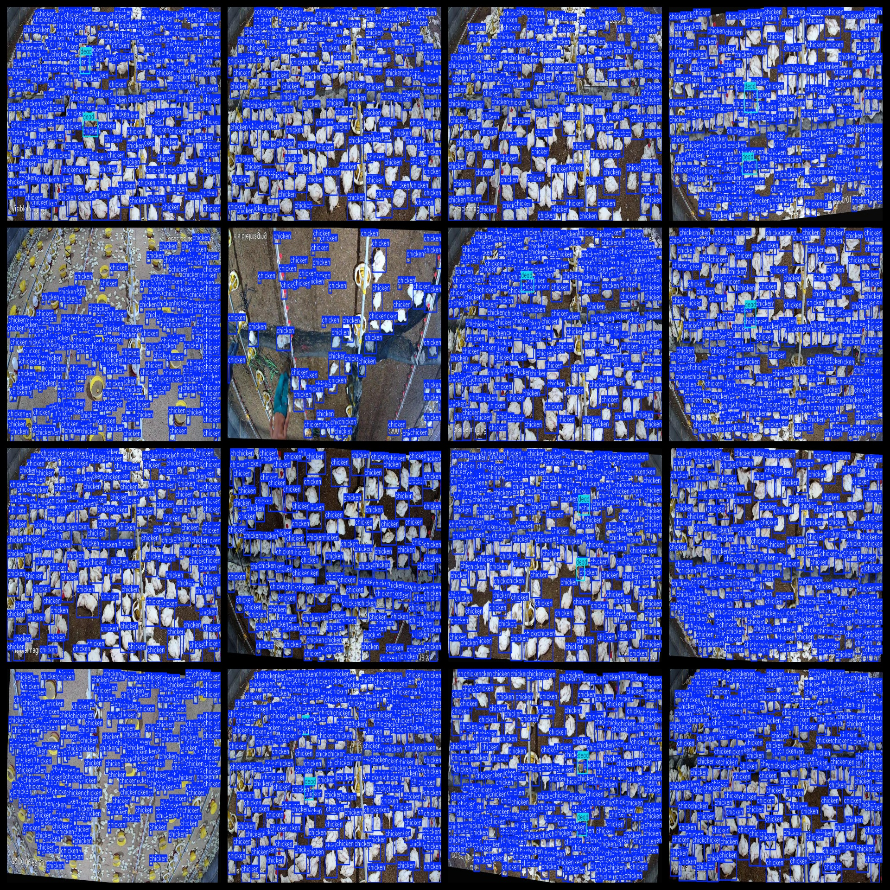
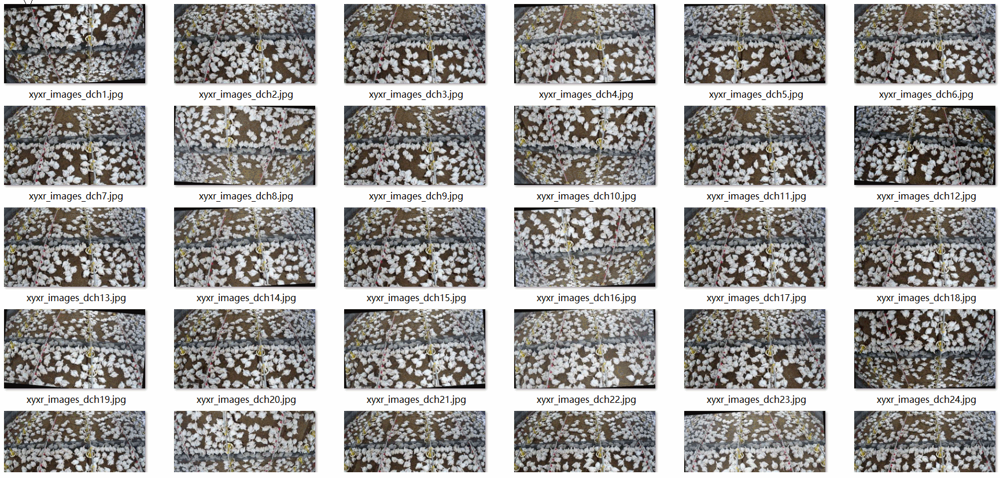

# Chicken in Shed Dead Chicken Detection Dataset 2025 imagesVOC+YOLO

Chicken in Shed Dead Chicken Detection Dataset 2025stretchVOC+YOLO

Dataset format: Pascal VOC format + YOLO format (the txt file does not contain the split path, it only contains jpg images and corresponding VOC format xml files and yolo format txt files)

Number of images (number of jpg files): 2025

Number of annotations (number of xml files): 2025

Number of txt files: 2025

Label count: 2

The Github repository is: datasets_sl

["dead","chicken"]

Number of boxes labeled in each category:

The number of chickens is 381023.

Dead Frame Count = 1214

Total frames: 382237

Number of images per category:

Chicken occupies 2025 pictures.

Dead occupancy = 780

Image resolution: 960x540

Use the labeling tool: labelImg

Dataset Augmentation: Yes

Rules for annotation: Draw a rectangle around the category.

Important Notice: The dataset has not been divided into training, validation, and test sets. Users are advised to partition the data themselves (the images are generally of poor clarity, with blurred edges upon magnification; please consult before purchasing).

Special Disclaimer: This dataset does not guarantee the accuracy of the trained models or weight files.

## Images

---

Here is a pay link on Stripe (https://buy.stripe.com/3cs8yP7sY87d0vu9AB). Please contact me lonlonago@foxmail.com after funding $89, and I will send you a complete data files, thank you!

